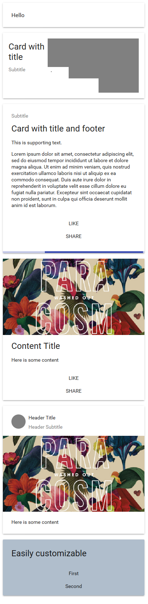

# Card
* 页头：md-card-header
** 主标题：md-card-title
** 副标题：md-card-subtitle
** 头像：md-card-avatar

* 标题组：md-card-title-group
** 标题组-标题：md-card-title
** 标题组-副标题：md-card-subtitle
** 标题组-小图片：md-card-sm-image
** 标题组-中图片：md-card-md-image
** 标题组-大图片：md-card-lg-image

* 图片：md-card-image
* 内容：md-card-content
* 动作：md-card-actions
* 页脚：md-card-footer

## Demo演示结果：
