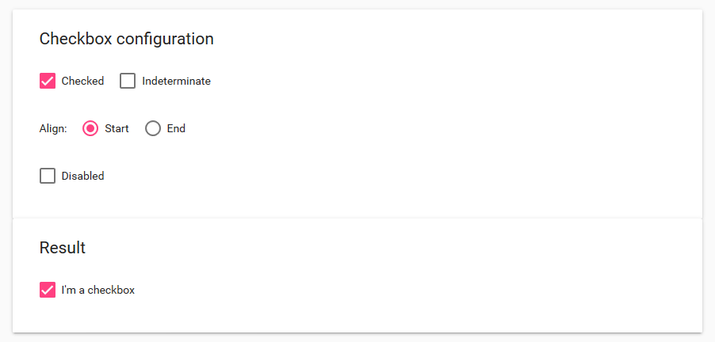
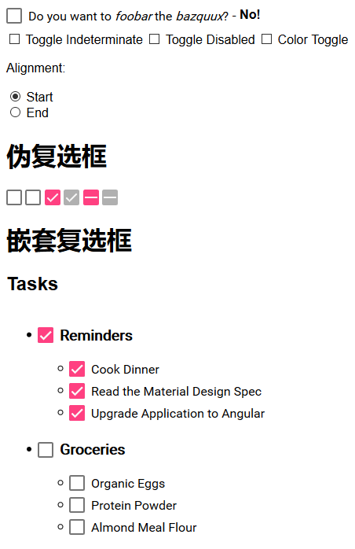

# Checkbox
## md-checkbox
* 属性
	* 该组件是否被选中的值与控制器中的值做双向绑定：ngModel
	* 不定选择：indeterminate
	* 对齐方式：align
	* 是否被禁用：disabled

# 伪复选框
## md-pseudo-checkbox
* 属性
	* 状态：state
	* 是否被禁用：disabled

# 嵌套复选框
## 具体实现看Demo中的代码

# Example演示结果：

# Demo演示结果：
