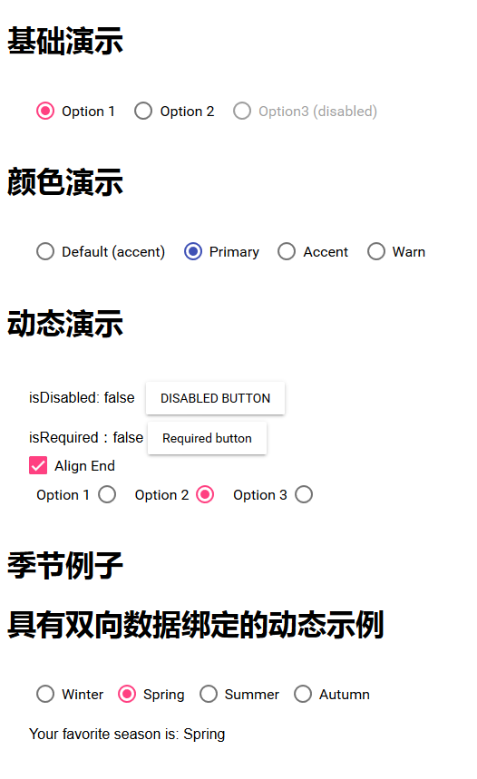

# Radio Button
## md-radio-group、md-radio-button
* md-radio-group属性
	* 名称：name
	* 是否被禁用：disabled
	* 必须的：required
	* 对齐方式：align
	* ngModel

* md-radio-button属性
	* 名称：name
	* 是否被禁用：disabled
	* 颜色：color
	* 值：value
	* ngModel

# Demo演示结果：
